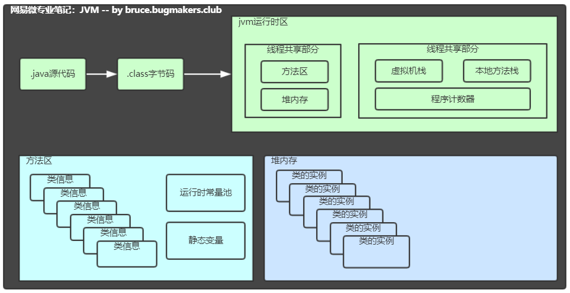

# JVM 运行时数据区

## 1、线程共享部分  

所有线程都可以访问这块内存数据，随虚拟机或者GC而创建或销毁

### 1.1、方法区

jvm用来存储类、常量、静态变量、编译后的代码等数据。

虚拟机规范中这是一个逻辑区划，不同的虚拟机有不同的实现。

如：oracle的HotSpot在java7中方法区放在永久代，java8放在元数据空间，并且通过GC机制对这个区域进行管理。

### 1.2、堆内存

JVM启动时创建，存放对象的实例。

垃圾回收器主要管理堆内存。

如果堆内存满了，就会出现OutOfMemoryError。

## 2、线程独享部分

每个线程都会有他独立的空间，随线程生命周期而创建或销毁

### 2.1、虚拟机栈

每个线程都在这个空间有一个私有的空间，为虚拟机执行java方法而准备的。

线程栈由多个栈帧（Stack Frame）组成。

一个线程会执行一个或多个方法，一个方法对应一个栈帧。

栈帧内容：局部变量表、操作数栈、动态链接、方法返回地址、附加信息等。

栈内存默认最大是1M，超出则抛出 StackOverflowError

### 2.2、本地方法栈

与虚拟机栈类似，为虚拟机使用Native本地方法而准备的。

不同的虚拟机厂商有不同的实现，HotSpot虚拟机中虚拟机栈和本地方法栈的实现是一样的，同样超出大小以后会抛出 StackOverflowError

### 2.3、程序计数器

记录当前线程执行字节码的位置，存储的是字节码指令地址，如果执行Native方法，则计数器值为空。

每个线程都在这个空间有一个私有的空间，战勇内存空间很少。

cpu同一时间，只会执行一条线程中的指令。jvm多线程会轮流切换并分配cpu执行时间的方式。在线程切换后，需要通过程序计数器来恢复正确的执行位置。