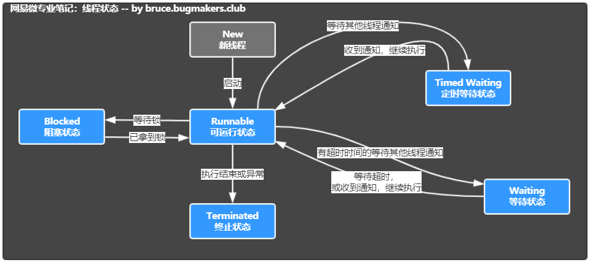

# 线程状态

* New：尚未启动的线程的线程状态

* Runnable：可运行线程的线程状态，等待CPU调度

* Blocked：线程阻塞等待监视器锁定的线程状态，处于synchronized同步代码块或方法中被阻塞

* Waiting：等待线程的线程状态。下列不带超时的方式：Object.wait、Thread.join、LockSupport.park

* TimedWaiting：具有指定等待时间的等待线程的线程状态。下列带超时的方式：Thread.sleep、Object.wait、Thread.join、LockSupport.parkNanos、LockSupport.parkUntil

* Terminated：终止线程的线程状态。线程正常完成执行或者出现异常。